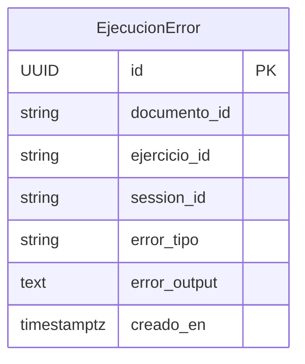

# feat: LLM Student Guidance (Phase 3)

## Overview

Add Socratic LLM feedback for students when their code fails. When a student's code execution produces an error, the system sends the code and error output to Gemini (via LiteLLM) and returns a structured Spanish-language hint. A graduated intervention model prevents hint-farming while avoiding student frustration: feedback is given immediately on the first error, then the student is required to attempt independently for a configurable silence window before the next hint is unlocked, up to a configurable hard limit.

All state tracking lives in Redis (already running). Rate-limit identity is a browser-generated session UUID — no authentication is required. Error events are logged to a new DB table for future teacher analytics, with no teacher-facing UI in this phase.

(see origin: docs/brainstorms/2026-03-22-llm-student-guidance-requirements.md)

## Problem Statement / Motivation

Students working through geographic/statistical programming exercises get stuck on syntax and library errors that are not related to the learning objectives. Without guidance, these moments build frustration and cognitive overload that diverts attention from the analytical concepts the course aims to teach. Too much LLM help creates the opposite problem — students skip the struggle that builds understanding.

The graduated intervention model (immediate feedback → forced independent attempts → next feedback → hard limit) is the pedagogically motivated design. See origin document for rationale on attempt-count vs. time-based silence.

## Critical Finding — stderr vs. error Chunk Types

Research revealed a key mismatch in the existing code:

- `tipo="error"` in the WebSocket stream is a **system-level error** (pool exhausted, unsupported language). The JS already calls `solicitarRetroalimentacion` on this type.
- `tipo="stderr"` carries **actual Python/R tracebacks** — `NameError`, `SyntaxError`, etc. The JS does **not** currently call `solicitarRetroalimentacion` on stderr.

Phase 3 must fix this: feedback must be triggered on `tipo="stderr"` output that looks like a traceback, not only on `tipo="error"`. The recommended approach is to collect all stderr chunks during an execution run and, when `tipo="fin"` arrives, check if any stderr was non-empty and trigger feedback if so. This avoids re-triggering on every individual stderr chunk (tracebacks arrive as multiple sequential chunks).

## Proposed Solution

### Architecture

```
Student code errors
  → senda-live.js collects stderr → on "fin", calls POST /api/retroalimentacion/{ejercicio_id}
  → retroalimentacion.py router
      → checks Redis rate limit state for (session_id, ejercicio_id)
      → if silenced: return {silencio: true}
      → if limit reached: return {silencio: true, limite: true}
      → else: call llm_feedback.py service
          → litellm.acompletion(model=settings.llm_model, ...)
          → parse structured JSON response
          → log to EjecucionError table (async, fire-and-forget)
          → return {retroalimentacion, pregunta_guia, mostrar_pista}
```

### Rate Limiter State (Redis)

Key pattern: `feedback:{session_id}:{ejercicio_id}` — a Redis hash with two fields:

- `total_feedbacks` (int) — incremented each time feedback is returned
- `attempts_since_feedback` (int) — incremented on each call; reset to 0 when feedback is given

**Decision logic on each POST:**

1. `total_feedbacks >= max` → return `{silencio: true, limite: true, mensaje: "..."}`
2. `total_feedbacks == 0` → give feedback (first error, always help)
3. `attempts_since_feedback < silence_window` → increment attempts, return `{silencio: true}`
4. `attempts_since_feedback >= silence_window` → give feedback, reset attempts to 0

No TTL on the hash — it persists for the session UUID lifetime. If the student reloads the page, a new UUID is generated and the counter resets (soft limit, acceptable for this stage).

### Structured LLM Response Schema

```json
{
  "diagnostico": "Descripción breve del error en español",
  "pregunta_guia": "Pregunta socrática que guía al estudiante",
  "referencia_concepto": "Concepto estadístico/geográfico relacionado",
  "mostrar_pista": true
}
```

Requested via `response_format={"type": "json_object"}`. On LiteLLM exception or JSON parse failure: return hardcoded Spanish fallback — `"No pudimos obtener retroalimentación en este momento. Intenta revelar una pista."`.

### Session Identity

`session_id` is a UUID generated by `senda-live.js` on first load and stored in `sessionStorage`. It is included in the POST request body. If absent, the backend falls back to the client IP (`request.client.host`).

### Provider Configuration

Default for Phase 3: `LLM_MODEL=gemini/gemini-2.0-flash`. LiteLLM handles Gemini natively — no `LLM_API_BASE` required (remove Ollama default). Ollama remains in `docker-compose.yml` under a compose profile (`--profile ollama`) so it does not start by default.

## Technical Considerations

- **Use `litellm.acompletion`** (async) — not the sync variant. Prior learning (`async-python-fastapi-sqlalchemy-impl-pitfalls.md`) confirms that blocking sync calls from `async def` routes freeze the event loop.
- **Redis client pattern:** use `redis.asyncio.from_url(settings.redis_url)` per-request, matching the existing `render_status.py` pattern. Close in a `finally` block.
- **Error logging is fire-and-forget:** `asyncio.create_task(log_error(...))` so that a DB write failure does not affect the feedback response.
- **API key never in HTML:** `LLM_API_KEY` is only read server-side by `llm_feedback.py`. Validate this in CI with a grep assertion on rendered HTML fixtures.
- **LiteLLM Gemini JSON mode:** Flagged as needing verification during implementation — LiteLLM maps `response_format` to Gemini's `response_mime_type="application/json"` internally. If this fails, fall back to prompt-based JSON instruction (`"Responde SOLO con un objeto JSON válido con los campos: ..."`).

## System-Wide Impact

- **Interaction graph:** Student error → JS collects stderr → POST `/retroalimentacion/{id}` → Redis read/write → LiteLLM call → DB insert (async) → JSON response → JS renders hint below code cell.
- **Error propagation:** LiteLLM failure → catch exception → return fallback string. Redis failure → catch exception → fail open (give feedback, skip rate limit check). DB write failure → swallowed in background task, logged to console.
- **State lifecycle risks:** Redis hash has no TTL. If `session_id` collides (astronomically unlikely with UUID4), a student could inherit another's counter. Acceptable for Phase 3.
- **No impact on existing routes:** `retroalimentacion` is a new, isolated router with no shared state except the Redis instance and DB session factory.

## Files to Create

| File | Purpose |
|---|---|
| `api/routers/retroalimentacion.py` | `POST /retroalimentacion/{ejercicio_id}` — orchestrates rate limiter + LLM + error log |
| `api/services/llm_feedback.py` | `async def generar_retroalimentacion(codigo, error, ejercicio_id)` via LiteLLM |
| `api/services/feedback_rate_limiter.py` | Redis-backed graduated intervention state machine |
| `api/schemas/retroalimentacion.py` | `FeedbackRequest`, `FeedbackResponse` Pydantic models |
| `api/models/ejecucion_error.py` | `EjecucionError` SQLAlchemy model for error event logging |
| `api/tests/unit/test_llm_feedback.py` | Unit tests with mocked `litellm.acompletion` |
| `api/tests/unit/test_feedback_rate_limiter.py` | Unit tests with mocked `aioredis` |

## Files to Modify

| File | Change |
|---|---|
| `api/main.py` | Register `retroalimentacion.router` with `prefix="/retroalimentacion"`; import `EjecucionError` model so it registers with `Base.metadata` |
| `api/config.py` | Add `feedback_silence_window: int = 2`, `feedback_max_responses: int = 3`; change `llm_api_base` default to `None`; update `llm_model` default to `"gemini/gemini-2.0-flash"` |
| `_extensions/senda/live/senda-live.js` | Collect stderr chunks; trigger `solicitarRetroalimentacion` at `tipo="fin"` if stderr was non-empty; generate and store `session_id` in `sessionStorage`; include `session_id` in POST body |
| `docker-compose.yml` | Move `ollama` service under `profiles: [ollama]` so it does not start by default |
| `.env.example` | Add `LLM_MODEL=gemini/gemini-2.0-flash`, `LLM_API_KEY=your-key-here`, remove/comment Ollama vars |

## Acceptance Criteria

- [ ] Student errors on attempt 1 → LLM hint appears below the code cell within 5 seconds
- [ ] Attempts 2–3 produce no hint (silence window=2 default)
- [ ] Attempt 4 error → second hint appears
- [ ] After `feedback_max_responses` hints, a Spanish message confirms no more hints are available
- [ ] Switching provider requires only env var change (no code changes) — verified by switching to a mock provider in test
- [ ] No `LLM_API_KEY` appears in any rendered HTML (grep assertion in CI)
- [ ] Python tracebacks (`tipo="stderr"`) trigger feedback — not just system errors (`tipo="error"`)
- [ ] Error events are queryable in `ejecucion_errors` table after a student exercise session
- [ ] All user-facing text (hints, limit messages, fallback) is in Spanish
- [ ] Unit tests pass for LLM service (mocked) and rate limiter (mocked Redis)
- [ ] Ollama does not start when running `docker compose up` without `--profile ollama`

## Dependencies & Risks

- **LiteLLM Gemini JSON mode:** May require prompt-level JSON instruction if `response_format` mapping is incomplete. Implement with defensive prompt fallback from the start.
- **`litellm` already declared** in `api/pyproject.toml` (`litellm>=1.50`) — no new package needed.
- **Redis already running** — same instance as Celery broker. No new infrastructure.
- **No Alembic** — `Base.metadata.create_all` at startup will pick up the new `EjecucionError` model automatically. This is fine for Phase 3; proper migrations are a Phase 4 concern.
- **`ejercicio_id` stability:** The exercise ID must be stable across page reloads (not dynamically assigned at render time). Verify that `senda-live.js` uses the block's `id` attribute from the rendered HTML — if this is not stable, the rate limiter key will reset on reload.

## ERD — New Model



No foreign key to `Documento` in Phase 3 — `documento_id` is stored as a plain string to avoid coupling before the unit/document model is formalized.

## Success Metrics

- LLM hint appears within 5 seconds of error (P95)
- No API key visible in rendered HTML (zero occurrences in grep)
- Rate limit prevents more than `feedback_max_responses` hints per exercise per session
- `ejecucion_errors` table has rows after a smoke-test session with intentional errors

## Sources & References

**Origin document:** [docs/brainstorms/2026-03-22-llm-student-guidance-requirements.md](../brainstorms/2026-03-22-llm-student-guidance-requirements.md)

Key decisions carried forward:
- Gemini (via LiteLLM) as active default; Ollama parked behind compose profile
- Graduated intervention (attempt count, not time-based) with configurable silence window and hard limit
- Log-only teacher analytics; no teacher UI in this phase
- Soft session identity via browser UUID (no auth)

**Internal references:**
- `api/ws/render_status.py` — async Redis pattern to follow
- `api/tasks/render_task.py` — sync Redis pattern (Celery context, not needed here)
- `api/routers/documentos.py` — router registration and `DbDep` alias pattern
- `api/config.py:14-17` — existing LLM settings fields
- `_extensions/senda/live/senda-live.js:231-234` — existing `tipo="error"` feedback trigger
- `_extensions/senda/live/senda-live.js:285-295` — existing `solicitarRetroalimentacion` function

**Institutional learnings:**
- `docs/solutions/security-issues/fastapi-upload-qmd-websocket-security-cluster.md` — use async LiteLLM client; do not block event loop with sync HTTP calls
- `docs/solutions/runtime-errors/async-python-fastapi-sqlalchemy-impl-pitfalls.md` — use `default=lambda: datetime.now(UTC)` (callable) for timestamp columns
