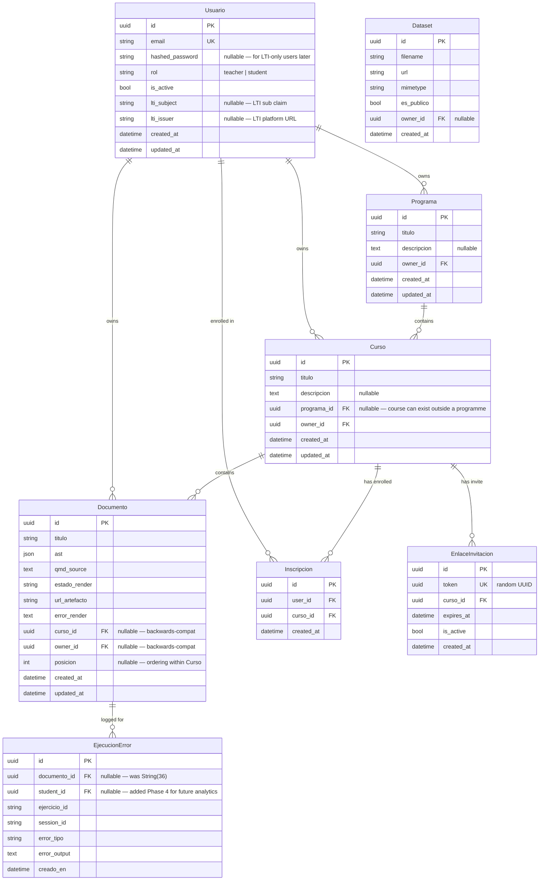

# feat: Content Hierarchy, Auth & Access Control

## Overview

Phase 4 of the Senda platform. Introduces three things that make the platform usable beyond a single-developer demo:

1. **Content hierarchy** — Programme → Course → Lesson (= Documento 1:1) as organizational navigation, not a new content model.
2. **Authentication** — teacher and student email/password accounts with JWT in `httpOnly` cookies, designed to be LTI-compatible without implementing LTI yet.
3. **Access control** — Course invite-link enrollment; enrolled students can access Lessons; unauthenticated users cannot manage content.
4. **Quiz blocks** — exercise block extension with optional reference-answer reveal and LLM direct-assessment (quality review) mode.
5. **Alembic migrations** — replaces `Base.metadata.create_all` as the DDL source of truth.

Anti-LMS principle (see origin document): Senda's scope is limited to content requiring code execution or LLM feedback. Quizzes are formative self-check only — no grading, no gradebook.

---

## Problem Statement / Motivation

The current platform is a flat, auth-free prototype:
- Any HTTP client can create, edit, or delete any document
- No concept of teacher ownership or student access
- No organizational structure — all documents appear in a flat list
- Schema is managed by `create_all` at startup, making migrations impossible
- The `ejercicio` block has no way to offer students a post-attempt reference answer or code quality feedback

None of these can ship in a real course context. Phase 4 fixes all of them without introducing LMS scope.

---

## Proposed Solution

Introduce a thin ownership and navigation layer on top of the existing content model. `Documento` (renamed conceptually to Lesson) does not change internally — the block editor, serializer, execution engine, and LLM feedback service are preserved. New models (`Usuario`, `Programa`, `Curso`, `Inscripcion`, `EnlaceInvitacion`) are added via Alembic migrations. Auth is JWT via `httpOnly` cookies, chosen for XSS resistance and compatibility with future LTI session passthrough.

---

## Data Model (ERD)



**Key design decisions:**
- `hashed_password` is nullable on `Usuario` to allow future LTI-only accounts (no Senda password, identity asserted by the LMS).
- `lti_subject` + `lti_issuer` are nullable string columns, making `(lti_issuer, lti_subject)` a future unique key for LTI login without schema changes.
- `curso_id` and `owner_id` on `Documento` are nullable for backwards-compatibility with existing documents.
- `programa_id` on `Curso` is nullable — a course can exist without being part of a programme.
- `posicion` on `Documento` is a nullable integer representing ordering within a `Curso`. Simple integer positions; reordering is done via `PATCH /cursos/{id}/lecciones/orden` accepting an ordered list of Documento IDs. No fractional indexing needed at this scale.
- `Programa` has a unique constraint on `(owner_id, titulo)` to prevent teachers from creating duplicate programme names.
- `EjecucionError.student_id` is added now (nullable FK → `usuarios.id`) to avoid a future data-migration gap. Analytics UI is still deferred.
- `Curso` deletion policy: `ON DELETE SET NULL` on `Documento.curso_id` (preserves Lessons as standalone). Teacher UI warns if enrollments exist before deleting a Course ("N estudiantes perderán acceso"). Backend allows deletion regardless.
- WebSocket code execution (`/ws/ejecutar`) is intentionally left unauthenticated in Phase 4. The enforcement gate is artifact access (the rendered HTML is only reachable by enrolled students). The execution pool is a shared resource, but it is also exposed only within the docker network (via nginx on port 8080). Revisit in Phase 5 (OpenStack) when the surface is broader.

---

## Technical Approach

### Architecture

Phase 4 builds in six sequential phases, each deployable independently:

```
Phase 1: Alembic foundation
  └── env.py (asyncpg-compatible), initial migration, Makefile targets

Phase 2: Authentication
  └── Usuario model → auth service (bcrypt + JWT) → auth router → auth dependency

Phase 3: Content hierarchy models
  └── Programa + Curso models → add FKs to Documento + EjecucionError → ownership dependency

Phase 4: Enrollment + invite links
  └── Inscripcion + EnlaceInvitacion → invite endpoints → access guard dependency

Phase 5: Quiz block
  └── ejercicio prop extension → QMD serializer update → /retroalimentacion quality mode → student JS extension

Phase 6: Frontend
  └── auth UI → hierarchy navigation → quiz block UX → protected routes
```

### Key Technical Choices

**JWT storage:** `httpOnly` cookies (not `localStorage`). Resistant to XSS. Two tokens:
- Access token: 15-minute TTL, stateless JWT
- Refresh token: 7-day TTL, stored in DB (allow revocation), also in `httpOnly` cookie

**Password hashing:** `bcrypt` via `asyncio.to_thread(bcrypt.hashpw, ...)` to avoid blocking the async event loop (same pattern as documented boto3 workaround in `docs/solutions/`).

**Alembic + asyncpg:** Alembic's migration runner is synchronous. Use a synchronous SQLAlchemy engine (psycopg2 URL) in `alembic/env.py` while the FastAPI app retains `create_async_engine` (asyncpg URL). Two settings in config:
- `DATABASE_URL` — `postgresql+asyncpg://...` (app)
- `SYNC_DATABASE_URL` — `postgresql+psycopg2://...` (Alembic only, derived from DATABASE_URL)

**Initial migration strategy:** Existing tables were created via `create_all`. Strategy:
1. Run `alembic revision --autogenerate -m "initial_schema"` against the live DB
2. The generated migration will reflect current schema correctly
3. `alembic stamp head` on the live DB to mark it as already applied
4. All Phase 4 schema additions are separate revision files applied on top

**LTI-compatible identity (design constraint, not Phase 4 deliverable):**
- `Usuario.lti_subject` + `Usuario.lti_issuer` nullable columns reserved
- Future LTI login: find-or-create `Usuario` by `(lti_issuer, lti_subject)` without creating a password account
- No structural changes needed in Phase 5 LTI implementation

---

## Implementation Phases

### Phase 1: Alembic Foundation

**Goal:** Replace `create_all` with proper migrations. No user-visible change.

**Tasks:**
- [ ] Add `psycopg2-binary` to dev dependencies in `pyproject.toml` (Alembic sync engine)
- [ ] Add `SYNC_DATABASE_URL` to `config.py`: derive from `DATABASE_URL` by replacing driver string
- [ ] Run `alembic init alembic` to scaffold directory
- [ ] Write `alembic/env.py`: import `Base` from `api.database`, use `SYNC_DATABASE_URL`, call `target_metadata = Base.metadata`
- [ ] Generate initial migration: `alembic revision --autogenerate -m "initial_schema"`
- [ ] Verify: migration only contains `create_table` for existing three tables; no surprises
- [ ] Stamp existing DB: `alembic stamp head`
- [ ] Remove `create_tables()` call from `main.py` lifespan (or convert to noop)
- [ ] Add Makefile targets: `make revision MSG="..."`, `make migrate`, `make migrate-down`
- [ ] Update `docker-compose.yml`: add a one-shot `migrator` service that runs `alembic upgrade head` before `api` starts (use `depends_on` + healthcheck)
- [ ] Tests: confirm startup works without `create_all`

**Files:**
- `alembic/` (new directory)
- `alembic/env.py`
- `alembic/versions/0001_initial_schema.py`
- `api/config.py` — add `SYNC_DATABASE_URL`
- `api/main.py` — remove `create_tables()` from lifespan
- `api/database.py` — mark `create_tables()` as deprecated / delete
- `docker-compose.yml` — migrator service
- `Makefile` — new targets

**Success criteria:**
- `make migrate` runs cleanly on a fresh DB
- Existing tests pass unchanged
- `alembic current` shows `head` on the dev DB

---

### Phase 2: Authentication

**Goal:** Teacher and student accounts, JWT via httpOnly cookies, auth dependencies.

**Tasks:**

*Models + migration:*
- [ ] `api/models/usuario.py` — `Usuario` model (see ERD above)
  - All `DateTime` columns: `DateTime(timezone=True)`, `default=lambda: datetime.now(UTC)`, `onupdate=lambda: datetime.now(UTC)`
  - `email`: `String(320)` (RFC 5321 max), unique index
  - `hashed_password`: `Text`, nullable
  - `rol`: `String(10)` — values `"teacher"` or `"student"`
  - `lti_subject`, `lti_issuer`: `String(255)`, nullable
- [ ] `api/models/sesion_refresh.py` — `SesionRefresh` for refresh token revocation
  - `id`, `jti` (UUID, unique, index), `user_id FK`, `expires_at`, `revoked_at` (nullable), `created_at`
- [ ] Alembic revision: `0002_add_usuarios_and_refresh_sessions`
- [ ] Register models in `main.py` noqa import or discover via `Base.metadata` scan

*Auth services:*
- [ ] `api/services/auth_service.py`
  - `hash_password(plain: str) -> str` — `asyncio.to_thread(bcrypt.hashpw, ...)`
  - `verify_password(plain: str, hashed: str) -> bool` — `asyncio.to_thread(bcrypt.checkpw, ...)`
  - `create_access_token(user_id, rol) -> str` — 15-min JWT, claims: `sub`, `rol`, `iat`, `exp`
  - `create_refresh_token(user_id) -> tuple[str, uuid]` — 7-day JWT, writes `SesionRefresh` row, returns (token, jti)
  - `verify_access_token(token: str) -> TokenPayload` — raises `HTTPException(401)` on failure
  - `revoke_refresh_token(jti: uuid, db)` — sets `revoked_at`

*Auth router:*
- [ ] `api/routers/auth.py` — prefix `/auth`
  - `POST /auth/registro` — body: `email: str Field(max_length=320), password: str Field(min_length=8, max_length=128), rol: Literal["teacher","student"]`
  - `POST /auth/login` — body: `email, password`; sets `access_token` and `refresh_token` `httpOnly` cookies
  - `POST /auth/logout` — clears cookies, revokes refresh token
  - `POST /auth/refresh` — reads refresh cookie, issues new access token
- [ ] Cookie policy: `HttpOnly=true`, `SameSite=Lax` (Strict breaks invite links arriving from email/Slack on a different origin), `Secure=true` in production only (env-var flag `COOKIE_SECURE`)
- [ ] All Pydantic request schemas have `max_length` on every string field (Phase 3 learning)

*Auth dependencies:*
- [ ] `api/dependencies/auth.py`
  - `get_current_user(request) -> Usuario` — reads access token from cookie, verifies, returns user or raises 401
  - `require_teacher(user = Depends(get_current_user)) -> Usuario` — raises 403 if `user.rol != "teacher"`
  - `require_student(user = Depends(get_current_user)) -> Usuario` — raises 403 if `user.rol != "student"`

*CORS update:*
- [ ] `api/main.py` — tighten `allow_origins` to `["http://localhost:8080"]` for dev; env-var configurable for prod
- [ ] Add `allow_credentials=True` (required for cookies)

*Tests:*
- [ ] `api/tests/unit/test_auth_service.py` — hash/verify, token create/verify (mock `asyncio.to_thread`)
- [ ] `api/tests/unit/test_auth_router.py` — register, login, logout, refresh flows (mock DB + service)

**Files:**
- `api/models/usuario.py` (new)
- `api/models/sesion_refresh.py` (new)
- `api/services/auth_service.py` (new)
- `api/routers/auth.py` (new)
- `api/dependencies/auth.py` (new)
- `api/main.py` — add auth router, update CORS
- `alembic/versions/0002_add_usuarios_and_refresh_sessions.py` (new)

**Success criteria:**
- Teacher can register + login; access token cookie is `httpOnly; SameSite=Lax`
- Invalid credentials return 401; missing token returns 401; wrong role returns 403
- Logout clears cookies and revokes refresh token in DB

---

### Phase 3: Content Hierarchy Models

**Goal:** Programme → Course → Lesson navigation; ownership on existing models.

**Tasks:**

*Models + migrations:*
- [ ] `api/models/programa.py` — `Programa` model (see ERD)
- [ ] `api/models/curso.py` — `Curso` model (see ERD)
- [ ] Alembic revision: `0003_add_programas_and_cursos`
- [ ] Alembic revision: `0004_add_fks_to_documento_and_ejecucion_error`
  - `Documento`: add `curso_id UUID nullable FK → cursos.id`, `owner_id UUID nullable FK → usuarios.id`, `posicion INTEGER nullable`
  - `Programa`: add unique constraint `(owner_id, titulo)`
  - `EjecucionError`: migrate `documento_id` from `String(36)` to `UUID nullable FK → documentos.id`; add `student_id UUID nullable FK → usuarios.id` (for future analytics — deferred UI)
  - Note: cast existing `documento_id` string values via `USING documento_id::uuid`; test against existing data before applying on a populated DB

*API endpoints:*
- [ ] `api/routers/programas.py` — prefix `/programas`
  - `POST /programas` (teacher only) — create; `owner_id = current_user.id`
  - `GET /programas` (teacher only) — list own programmes
  - `GET /programas/{id}` (teacher only) — get with courses
  - `PUT /programas/{id}` (owner only)
  - `DELETE /programas/{id}` (owner only)
- [ ] `api/routers/cursos.py` — prefix `/cursos`
  - `POST /cursos` (teacher only)
  - `GET /cursos` (teacher only) — list own courses
  - `GET /cursos/{id}` (owner or enrolled student)
  - `PUT /cursos/{id}` (owner only)
  - `DELETE /cursos/{id}` (owner only)
  - `GET /cursos/{id}/lecciones` (owner or enrolled student) — list Documentos in course order

*Ownership dependency:*
- [ ] `api/dependencies/ownership.py`
  - `require_owner(resource, current_user)` — raises 403 if `resource.owner_id != current_user.id`

*Update existing Documento router:*
- [ ] `POST /documentos` — if authenticated teacher, set `owner_id`; `curso_id` optional
- [ ] `GET /documentos/{id}` — if `Documento.curso_id` set, check enrollment (see Phase 4 dependency)
- [ ] Keep unauthenticated access to `url_artefacto` (served from MinIO directly — no auth needed there)

*Tests:*
- [ ] CRUD tests for Programa and Curso routers
- [ ] Ownership enforcement tests (403 on wrong owner)

**Files:**
- `api/models/programa.py` (new)
- `api/models/curso.py` (new)
- `api/routers/programas.py` (new)
- `api/routers/cursos.py` (new)
- `api/dependencies/ownership.py` (new)
- `api/routers/documentos.py` — add `owner_id`, `curso_id` support
- `alembic/versions/0003_add_programas_and_cursos.py` (new)
- `alembic/versions/0004_add_fks_to_documento_and_ejecucion_error.py` (new)

**Success criteria:**
- Teacher can create a Programme, create a Course within it, assign a Documento to the Course
- Ownership enforcement: PATCH/DELETE by non-owner returns 403
- Existing unauthenticated tests still pass (backwards-compat nullable FKs)

---

### Phase 4: Enrollment & Invite Links

**Goal:** Course invite link → student registration + auto-enrollment; access guards.

**Tasks:**

*Models + migration:*
- [ ] `api/models/inscripcion.py` — `Inscripcion` model; unique constraint on `(user_id, curso_id)`
- [ ] `api/models/enlace_invitacion.py` — `EnlaceInvitacion` model; `token` is a random UUID stored as string
- [ ] Alembic revision: `0005_add_inscripciones_and_enlaces_invitacion`

*Enrollment endpoints:*
- [ ] `POST /cursos/{id}/invitacion` (teacher, owner only)
  - Creates `EnlaceInvitacion` with `expires_at = now() + 7 days`, `is_active = True`
  - Returns `{ url: "https://senda.app/invitaciones/{token}" }`
- [ ] `GET /invitaciones/{token}` (public)
  - Returns `{ curso_titulo, is_valid, is_expired }` — used by frontend to show "Join Course" page
- [ ] `POST /invitaciones/{token}/canjear` (authenticated student)
  - Validates token: active, not expired
  - Atomic transaction: create `Inscripcion` if not already enrolled (upsert or check-then-insert)
  - Returns `{ curso_id, curso_titulo }` for redirect
  - Edge: already enrolled → 200 (idempotent, not an error)
- [ ] `GET /cursos/{id}/estudiantes` (teacher, owner only) — list enrolled users (id, email, created_at only — no PII beyond email); hard limit of 200 rows in Phase 4 with a `has_more` flag in the response; pagination deferred to Phase 5

*Access guard dependency:*
- [ ] `api/dependencies/access.py`
  - `require_enrolled_or_owner(documento_id, current_user) -> None`
    - If `Documento.curso_id` is null → no enrollment check (legacy/standalone doc)
    - If `current_user.rol == "teacher"` and `current_user.id == Curso.owner_id` → allow
    - If `current_user.rol == "student"` → check `Inscripcion` exists for `(current_user.id, Curso.id)`
    - Else → 403
  - Apply to `GET /documentos/{id}` and `GET /cursos/{id}/lecciones`

*Unauthenticated path preservation:*
- [ ] MinIO artifact URLs are public (unchanged) — students can view rendered HTML without auth
- [ ] WebSocket code execution (`/ws/ejecutar`) — keep session_id-based identity; enrollment check is not enforced at execution time (the rendered HTML is the enforcement gate)

*Tests:*
- [ ] Invite generation + redemption flow (happy path + expired + already enrolled)
- [ ] Access guard: 403 for non-enrolled student, 200 for owner, 200 for enrolled student
- [ ] Atomic test: concurrent redemption of same invite doesn't create duplicate Inscripcion

**Files:**
- `api/models/inscripcion.py` (new)
- `api/models/enlace_invitacion.py` (new)
- `api/routers/invitaciones.py` (new)
- `api/routers/cursos.py` — add `/invitacion` and `/estudiantes` endpoints
- `api/dependencies/access.py` (new)
- `api/routers/documentos.py` — apply access guard
- `alembic/versions/0005_add_inscripciones_and_enlaces_invitacion.py` (new)

**Success criteria:**
- Teacher generates invite; student follows link, registers, is enrolled; can access Lessons
- Non-enrolled student gets 403 on `GET /documentos/{id}` for course-bound documents
- Already-enrolled student can re-redeem invite without error or duplicate row

---

### Phase 5: Quiz Block

**Goal:** Extend `ejercicio` block with reference-answer reveal and LLM direct-assessment mode.

**Tasks:**

*Backend — LLM quality review:*
- [ ] `api/services/llm_feedback.py` — add `_QUALITY_REVIEW_SYSTEM_PROMPT` constant
  - Direct assessment mode: evaluate code for correctness of approach, conciseness, idiomatic use of geo/statistical libraries
  - Returns JSON: `{ evaluacion: str, sugerencias: [str], calidad: "excelente"|"adecuado"|"mejorable" }`
  - **Not Socratic** — direct, concrete assessment
- [ ] Add `modo` field to `FeedbackRequest` schema: `Literal["socratico", "calidad"]`, default `"socratico"`
- [ ] Branch system prompt in `generar_retroalimentacion` based on `modo`
- [ ] Quality review mode: bypass the graduated rate limiter (student explicitly requests it); apply a separate simpler rate limit (e.g. max 5 quality reviews per exercise per session)
- [ ] Tests: `test_llm_feedback.py` — quality review mode returns expected JSON shape

*Backend — QMD serializer (TDD):*
- [ ] `api/tests/unit/test_qmd_serializer.py` — add tests first:
  - `ejercicio` block with `esQuiz: "true"` serializes `solutionCode` into a fenced div with class `senda-quiz-solution`
  - `ejercicio` block with `esQuiz: "false"` behaves as before (no change)
- [ ] `api/services/qmd_serializer.py` — update `serialize_ejercicio` to handle quiz props

*Frontend — `ejercicio` block extension:*
- [ ] `frontend/src/editor/blocks/EjercicioNode.tsx`
  - Add props: `esQuiz: { default: "false" }`, `mostrarRevisionCalidad: { default: "false" }`
  - `solutionCode` (existing prop) serves as the reference answer — no new prop needed
  - Teacher UI: toggle checkbox "Es un ejercicio de quiz" + "Permitir revisión de calidad por IA"
- [ ] `frontend/src/editor/schema.ts` — no change needed (props auto-registered)
- [ ] `frontend/src/editor/serializer.ts` — pass `esQuiz` and `mostrarRevisionCalidad` through to AST
- [ ] `frontend/src/api/types.ts` — add `esQuiz` and `mostrarRevisionCalidad` to `EjercicioBlock` type

*Frontend — student-facing (Quarto extension):*
- [ ] `_extensions/senda/senda-live.js` — in the exercise cell event handler:
  - After successful execution on a quiz block (`data-senda-quiz="true"`): reveal "Ver solución del profesor" button
  - "Ver solución" click: toggle display of `div.senda-quiz-solution` (already in rendered HTML from QMD)
  - If `data-senda-calidad="true"`: also show "Solicitar revisión de calidad" button after success
  - "Solicitar revisión" click: `POST /api/retroalimentacion/{ejercicio_id}` with `{ ..., modo: "calidad" }` → display result in a styled panel (not Socratic hint style)
- [ ] i18n: add Spanish strings in `frontend/src/i18n/es.json`:
  - `"verSolucion"`, `"ocultarSolucion"`, `"solicitarRevision"`, `"revisionCalidad"`, etc.

*Tests:*
- [ ] `frontend/src/editor/__tests__/serializer.test.ts` — quiz block serialization
- [ ] `api/tests/unit/test_llm_feedback.py` — quality review mode

**Files:**
- `api/services/llm_feedback.py` — quality review prompt + mode branching
- `api/routers/retroalimentacion.py` — pass `modo` to service
- `api/services/qmd_serializer.py` — quiz solution fenced div
- `api/tests/unit/test_qmd_serializer.py` — quiz serialization tests
- `api/tests/unit/test_llm_feedback.py` — quality review tests
- `frontend/src/editor/blocks/EjercicioNode.tsx` — add quiz props + teacher UI
- `frontend/src/editor/serializer.ts` — pass quiz props
- `frontend/src/api/types.ts` — extend `EjercicioBlock`
- `frontend/src/i18n/es.json` — quiz UI strings
- `_extensions/senda/senda-live.js` — quiz button logic

**Success criteria:**
- Teacher can mark an exercise as a quiz and enter a reference solution
- Student runs quiz block successfully → "Ver solución" button appears
- Student clicks "Ver solución" → teacher's code is revealed
- Student clicks "Solicitar revisión de calidad" → direct assessment rendered (not Socratic hint)
- Non-quiz exercises behave exactly as before
- QMD serializer tests pass for both quiz and non-quiz variants

---

### Phase 6: Frontend

**Goal:** Auth UI, hierarchy navigation, protected routes, quiz block student UX (Quarto extension handled in Phase 5).

**Tasks:**

*Auth UI:*
- [ ] `frontend/src/pages/Login.tsx` — email/password form; `POST /api/auth/login`; redirect to `/` on success
- [ ] `frontend/src/pages/Registro.tsx` — email/password form; `POST /api/auth/registro`; used standalone and via invite redemption flow
- [ ] `frontend/src/pages/CanjearInvitacion.tsx` — reads `token` from URL param; shows Course name; "Unirme" button calls `POST /api/invitaciones/{token}/canjear`; redirects to Course view on success
- [ ] `frontend/src/hooks/useAuth.ts` — reads current user from `GET /api/auth/me` (add this endpoint); exposes `{ user, isLoading, logout }`
- [ ] `frontend/src/components/ProtectedRoute.tsx` — wraps React Router routes; redirects to `/login` if not authenticated

*Hierarchy navigation (teacher):*
- [ ] `frontend/src/pages/Inicio.tsx` — replace flat list with Programme → Course → Lesson tree
  - Teacher sees their Programmes and Courses, can navigate into a Course to see its Lessons
  - "Nuevo programa", "Nuevo curso", "Nueva lección" actions
- [ ] `frontend/src/pages/Programa.tsx` — Programme detail: list of Courses
- [ ] `frontend/src/pages/Curso.tsx` — Course detail: list of Lessons (ordered), enrolled student count, "Generar invitación" button
- [ ] `frontend/src/pages/Estudiantes.tsx` — enrolled student list for a Course (email, enroll date)
- [ ] New API calls: `api/programas.ts`, `api/cursos.ts`, `api/invitaciones.ts`

*Student view:*
- [ ] `frontend/src/pages/MisCursos.tsx` — student home: **flat list of enrolled Courses** (Programme is teacher-side navigation only; students do not see the Programme level); each Course card shows its ordered Lesson list

*`apiFetch` update:*
- [ ] `frontend/src/api/client.ts` — add `credentials: "include"` to all fetch calls (required for httpOnly cookie transmission)
- [ ] Handle 401 responses: clear auth state, redirect to `/login`

*Routing:*
- [ ] `frontend/src/App.tsx` — add routes:
  - `/login`, `/registro`, `/invitaciones/:token` (public)
  - `/` (teacher home if rol=teacher, student home if rol=student)
  - `/programas/:id`, `/cursos/:id`, `/cursos/:id/estudiantes` (teacher, protected)
  - `/mis-cursos` (student, protected)
  - `/editor`, `/editor/:id` (teacher, protected)

*Lesson ordering:*
- [ ] `PATCH /cursos/{id}/lecciones/orden` (teacher, owner only) — body: `{ orden: [uuid] }` (ordered list of Documento IDs); updates `posicion` for each in a single transaction
- [ ] Frontend Course detail page: drag-to-reorder Lessons (or up/down arrows); calls the PATCH endpoint on drop/click

*Student pending-artifact state:*
- [ ] `frontend/src/pages/Leccion.tsx` — student Lesson view:
  - If `estado_render == "pendiente" | "procesando"`: show spinner + "El profesor está preparando esta lección, vuelve pronto" (poll `GET /documentos/{id}` every 10s)
  - If `estado_render == "fallido"`: show "Esta lección no está disponible en este momento" (don't expose error details)
  - If `estado_render == "listo"`: render artifact in iframe (current behaviour)

*i18n strings:*
- [ ] Add all new UI labels to `frontend/src/i18n/es.json`

**Files:**
- `frontend/src/pages/Login.tsx` (new)
- `frontend/src/pages/Registro.tsx` (new)
- `frontend/src/pages/CanjearInvitacion.tsx` (new)
- `frontend/src/pages/Programa.tsx` (new)
- `frontend/src/pages/Curso.tsx` (new)
- `frontend/src/pages/Estudiantes.tsx` (new)
- `frontend/src/pages/MisCursos.tsx` (new)
- `frontend/src/hooks/useAuth.ts` (new)
- `frontend/src/components/ProtectedRoute.tsx` (new)
- `frontend/src/api/programas.ts` (new)
- `frontend/src/api/cursos.ts` (new)
- `frontend/src/api/invitaciones.ts` (new)
- `frontend/src/api/client.ts` — add `credentials: "include"`, 401 handling
- `frontend/src/App.tsx` — new routes
- `frontend/src/pages/Inicio.tsx` — hierarchy view
- `frontend/src/i18n/es.json` — new strings

**Success criteria:**
- Unauthenticated user is redirected to `/login` when accessing protected routes
- Teacher sees Programme/Course/Lesson hierarchy; can create at each level
- Student sees enrolled Courses and their Lessons after invite redemption
- All UI labels are in Spanish

---

## System-Wide Impact

### Interaction Graph

**Teacher creates Course and generates invite:**
```
POST /auth/login → sets httpOnly cookies (access + refresh tokens)
POST /programas → INSERT Programa (owner_id = current_user.id) → 201
POST /cursos → INSERT Curso (programa_id, owner_id) → 201
POST /documentos → INSERT Documento (curso_id, owner_id) → Celery render task queued
POST /cursos/{id}/invitacion → INSERT EnlaceInvitacion (token=UUID, expires_at=now+7d) → returns URL
```

**Student redeems invite:**
```
GET /invitaciones/{token} → validate EnlaceInvitacion (active + not expired) → return course info
POST /auth/registro → INSERT Usuario (rol="student") → sets cookies
POST /invitaciones/{token}/canjear → [transaction]:
  validate token again (race: two students hitting at once)
  INSERT Inscripcion (user_id, curso_id) ON CONFLICT DO NOTHING
  → return { curso_id }
```

**Student accesses Lesson:**
```
GET /documentos/{id} → Depends(require_enrolled_or_owner):
  load Documento → if curso_id null → allow
  load Curso → if current_user is owner → allow
  SELECT Inscripcion WHERE user_id=current AND curso_id=Curso.id → if exists allow, else 403
→ return Documento (url_artefacto)
Browser fetches artifact URL from MinIO (public, no auth)
```

**Student requests quality review:**
```
POST /retroalimentacion/{ejercicio_id} body: { ..., modo: "calidad" }
→ quality rate limit check (separate Redis key namespace "calidad:")
→ generar_retroalimentacion(modo="calidad") → _QUALITY_REVIEW_SYSTEM_PROMPT
→ litellm.acompletion → { evaluacion, sugerencias, calidad }
→ return 200 JSON (not the Socratic hint shape)
```

### Error & Failure Propagation

| Scenario | Where caught | Response |
|---|---|---|
| Expired/invalid JWT | `get_current_user` dependency | 401 → frontend redirects to `/login` |
| Expired invite link | `POST /invitaciones/{token}/canjear` | 400 `{ detail: "El enlace ha expirado" }` |
| Duplicate enrollment (race) | DB unique constraint on `Inscripcion` | caught in router → 200 (idempotent) |
| Auth on refresh token: revoked | `POST /auth/refresh` | 401 → full logout |
| Quality review rate limit hit | Feedback rate limiter | 429 `{ detail: "Límite de revisiones alcanzado" }` |
| DB commit failure during invite redemption | SQLAlchemy exception in transaction | 500; no partial state (transaction rolled back atomically) |

### State Lifecycle Risks

- **Orphaned refresh tokens:** If a user never logs out, refresh tokens accumulate in `SesionRefresh`. Add a nightly Celery beat task: `DELETE FROM sesiones_refresh WHERE expires_at < NOW() OR revoked_at IS NOT NULL`. This is a maintenance task, not a security risk (expired tokens are already invalid).
- **Orphaned invite links:** `EnlaceInvitacion` rows with `is_active=False` or past `expires_at` accumulate. Same nightly cleanup. Not security-critical.
- **Invite redemption race:** Two students submit `POST /invitaciones/{token}/canjear` simultaneously. Both pass token validation, both attempt `INSERT Inscripcion`. The unique constraint on `(user_id, curso_id)` catches the duplicate. Both return 200. No duplicate enrollment.
- **Documento orphaned from Curso:** If a Curso is deleted while Documentos reference it, `curso_id FK` with `ON DELETE SET NULL` preserves the Documento as standalone. This is the correct behavior (don't delete student content when a course is removed).
- **Cookie / CORS misconfiguration:** `allow_credentials=True` + `allow_origins=["*"]` is rejected by browsers. CORS must be tightened to specific origins before cookies work. This is Phase 4 work (see Phase 2 tasks).

### API Surface Parity

- `GET /documentos/{id}` is the primary Lesson access route. Access guard must be applied consistently — currently unauthenticated, will add `Optional[Depends(get_current_user)]` to distinguish logged-in vs. anonymous (anonymous can only access Documentos with no `curso_id`).
- `GET /cursos/{id}/lecciones` must apply the same enrollment check as `GET /documentos/{id}`.
- `WS /ws/ejecutar` — deliberately excluded from enrollment check (enforcement is at HTML artifact delivery, not at execution time). Document this explicitly to avoid future confusion.

### Integration Test Scenarios

1. **Full teacher → student flow:** Register teacher → create Programme + Course + Documento → render completes → generate invite → register student via invite → redeem invite → student GET `/documentos/{id}` returns 200
2. **Access rejection:** Enroll student in Course A. Attempt GET `/documentos/{id}` for a Documento in Course B → expect 403.
3. **Quiz quality review:** POST feedback with `modo: "calidad"` → response contains `evaluacion`, `sugerencias`, `calidad` fields; response does NOT contain `pregunta_guia` (Socratic shape).
4. **Invite expiry:** Create invite, manually set `expires_at = now() - 1 minute`, attempt redemption → expect 400.
5. **Concurrent invite redemption:** Two concurrent POST to same `/canjear` endpoint for same user → exactly one `Inscripcion` row in DB.

---

## Acceptance Criteria

### Functional Requirements

- [ ] Teacher can register, log in, create Programme + Course + Lesson, generate Course invite link
- [ ] Student can follow invite link, register, be auto-enrolled, access all Lessons in the Course
- [ ] Unauthenticated request to any teacher management endpoint returns 401
- [ ] Non-enrolled student GET on a course-bound Documento returns 403
- [ ] Teacher can view enrolled student list for any Course they own
- [ ] Quiz block: teacher can mark an exercise as quiz, enter a reference solution, enable quality review
- [ ] Student sees "Ver solución del profesor" button after successfully running a quiz exercise
- [ ] Student can request LLM quality review; response is a direct assessment (not Socratic hints)
- [ ] Non-quiz exercises behave identically to current behavior
- [ ] `make migrate` applies all migrations to a clean DB; `make migrate-down` rolls back one step

### Non-Functional Requirements

- [ ] Access tokens in `httpOnly; SameSite=Lax` cookies — not in `localStorage`
- [ ] All Pydantic auth schema fields have `max_length` (and passwords have `min_length`)
- [ ] All new `DateTime` columns use `DateTime(timezone=True)` with `default=lambda: datetime.now(UTC)`
- [ ] bcrypt hashing runs in `asyncio.to_thread` (not blocking event loop)
- [ ] Redis keys for auth rate limiting are hashed (no raw user-controlled values as key segments)
- [ ] CORS `allow_origins` is no longer `["*"]` — restricted to configured origin(s)
- [ ] No JWT or session token appears in rendered HTML artifacts (existing security requirement maintained)

### Quality Gates

- [ ] All existing 68 tests continue to pass
- [ ] New unit tests for auth service, auth router, Programa/Curso CRUD, enrollment flow, quiz LLM mode, QMD serializer quiz variant
- [ ] `alembic check` passes (no uncommitted schema drift)

---

## Dependencies & Prerequisites

- Phase 1 (Alembic) must complete before any Phase 2–5 DB changes
- Phase 2 (auth) must complete before Phase 3 (ownership) and Phase 4 (enrollment guard)
- Phase 3 (hierarchy models) must complete before Phase 4 (invite enrollment references Curso)
- Phase 5 (quiz block) can proceed in parallel with Phase 6 (frontend) after Phase 2
- `psycopg2-binary` needed as a dev dependency for Alembic sync engine

---

## Risk Analysis & Mitigation

| Risk | Likelihood | Mitigation |
|---|---|---|
| Alembic initial migration conflicts with existing tables | Medium | Use `alembic stamp head` strategy; inspect generated migration before applying |
| bcrypt blocks event loop (forgotten `asyncio.to_thread`) | Low (documented) | Grep for `bcrypt.hashpw` outside `to_thread` before PR |
| DateTime timezone naive columns | Low (documented) | Use detection grep: `default=datetime\.now\b` |
| CORS misconfiguration breaks cookies | Medium | Test cookie transmission immediately after Phase 2 auth is wired |
| Invite redemption race creates duplicate enrollments | Low | Unique constraint + idempotent handler |
| `EjecucionError.documento_id` String→UUID migration fails on existing data | Medium | Test `USING documento_id::uuid` in staging; malformed strings will surface as migration errors |
| Quiz "Ver solución" reveals answer too early (before attempt) | Low | Button appears only after successful execution (JS state check in senda-live.js) |

---

## Future Considerations

- **Moodle LTI integration (Phase 5):** `Usuario.lti_subject + lti_issuer` columns are reserved. LTI 1.3 login flow: validate platform JWKS, extract `sub` claim, find-or-create `Usuario` without password. JWKS document must be cached + fetched with timeout + semaphore (see institutional learnings).
- **Teacher analytics:** `ejecucion_errores` now has a proper FK to `documentos`. Once Phase 4 is stable and real usage exists, aggregate queries (error frequency per exercise, quiz pass-rate proxy from quality-review scores) become straightforward.
- **Invite link policies:** Phase 4 uses 7-day multi-use links. Single-use links and per-link use-count limits are additive changes to `EnlaceInvitacion`.
- **CORS for OpenStack deploy:** `CORS_ALLOWED_ORIGINS` env var is introduced in Phase 4 (Phase 2 task). Phase 5 (OpenStack) just sets it to the production domain.
- **Refresh token rotation:** Phase 4 issues long-lived refresh tokens without rotation. Token rotation (issue new refresh + revoke old on each `/auth/refresh`) can be added without breaking the model.

---

## Sources & References

### Origin

- **Origin document:** [docs/brainstorms/2026-03-22-phase-4-content-auth-requirements.md](../brainstorms/2026-03-22-phase-4-content-auth-requirements.md)
  Key decisions carried forward: (1) Lesson = Documento 1:1 — hierarchy is navigation only; (2) quiz = formative self-check, no grading; (3) LTI-compatible auth design via nullable `lti_subject`/`lti_issuer` columns

### Internal References

- Auth `SECRET_KEY` already present: `api/config.py:19`
- `alembic` declared in `pyproject.toml:10` — not yet wired
- `ejercicio` block props (incl. existing `solutionCode`): `frontend/src/editor/blocks/EjercicioNode.tsx:8–15`
- Custom block registration pattern: `frontend/src/editor/schema.ts`
- LLM feedback service (Socratic prompt, rate limiter): `api/services/llm_feedback.py`, `api/services/feedback_rate_limiter.py`
- Existing `EjecucionError.documento_id` as `String(36)` (to migrate): `api/models/ejecucion_error.py`
- Test patterns: `api/tests/unit/test_llm_feedback.py`, `api/tests/unit/test_feedback_rate_limiter.py`

### Institutional Learnings

- AsyncSession must not cross `asyncio.create_task` boundary: `docs/solutions/security-issues/phase-3-llm-guidance-pre-merge-review-fixes.md`
- `default=datetime.now(UTC)` is a frozen value trap — use lambda: `docs/solutions/runtime-errors/async-python-fastapi-sqlalchemy-impl-pitfalls.md`
- Redis: singleton, hashed keys, mandatory TTL: `docs/solutions/security-issues/phase-3-llm-guidance-pre-merge-review-fixes.md`
- DB commit before Redis publish: `docs/solutions/security-issues/fastapi-upload-qmd-websocket-security-cluster.md`
- bcrypt is CPU-bound — use `asyncio.to_thread`: pattern from `docs/solutions/security-issues/fastapi-upload-qmd-websocket-security-cluster.md` (boto3 analogue)
- Pydantic `Field(max_length=N)` required on all user-supplied strings: `docs/solutions/security-issues/phase-3-llm-guidance-pre-merge-review-fixes.md`
- JWT/session tokens → `httpOnly` cookies, not `localStorage`: `docs/solutions/security-issues/phase-3-llm-guidance-pre-merge-review-fixes.md`
- Alembic initial migration: stamp existing schema, guard against existing tables: `docs/plans/2026-03-22-001-feat-llm-student-guidance-plan.md:145`
- BlockNote `createReactBlockSpec` factory pattern: `docs/solutions/integration-issues/blocknote-047-typescript-integration-pitfalls.md`
- UUID path params: stringify immediately: `docs/solutions/runtime-errors/async-python-fastapi-sqlalchemy-impl-pitfalls.md`
